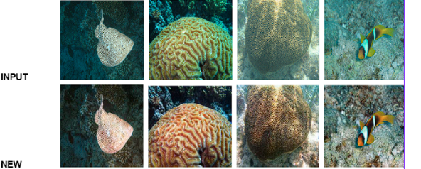

# 🌊 Underwater Image Enhancement Microservice (SeaPixGAN)

A deep learning-powered REST API that enhances underwater images by reducing haze, restoring color, and improving visibility. This microservice wraps a trained GAN model using Flask and exposes it as a Dockerized backend API — ready for real-world deployment.

> 🚀 Designed to demonstrate a production-ready ML deployment pipeline using PyTorch, Flask, Docker, and REST APIs.

---

## 📸 Sample Results



---

## 🧠 Architecture Overview

- **Model:** Custom GAN (HybridGenerator + PatchGAN Discriminator)
- **Training Dataset:** [EUVP dataset](https://irvlab.cs.umn.edu/resources/euvp-dataset) *(subsampled for demo)*
- **Loss Functions:**
  - Adversarial Loss
  - L1 Pixel Loss
  - Perceptual Loss (VGG19-based)
  - Gradient Difference Loss
- **Deployment:** Flask API + Docker container

---

## 📁 Project Structure

```
.
├── app.py             # REST API using Flask
├── enhancer.py        # Inference logic (loads model, enhances image)
├── model.py           # GAN architecture (HybridGenerator)
├── checkpoints/       # Trained model file (removed from repo)
├── test/              # Input test images
├── output/            # Enhanced image results
├── batch_upload.py    # For batch image testing
├── requirements.txt   # Python dependencies
├── Dockerfile         # Docker setup
└── README.md          # This file
```

---

## 🚀 Quickstart Guide

### 1️⃣ Clone the Repository

```bash
git clone https://github.com/BharathVishnu/underwater-image-enhancement-deep-learning-model.git
cd underwater-image-enhancement-deep-learning-model
```

### 2️⃣ Install Dependencies

```bash
pip install -r requirements.txt
```

### 3️⃣ Start the API

```bash
python app.py
```

The server will start at:

```
http://localhost:5000
```

---

## 🎯 API Usage

### 🖼️ POST `/enhance`

**Description:** Upload an image to receive the enhanced version.

#### Request:
- **Method:** POST  
- **Content-Type:** `multipart/form-data`  
- **Field:** `image`

**Example (curl):**

```bash
curl -X POST -F "image=@test/test1.jpg" http://localhost:5000/enhance
```

#### Response:
```json
{
  "message": "Image enhanced successfully",
  "output_path": "output/enhanced_test1.jpg",
  "processing_time": 1.27
}
```

---

### 📊 GET `/metrics`

Returns API uptime and status.

```json
{
  "status": "running",
  "uptime": 123.45
}
```

### 1️⃣ Build Docker Image

```bash
docker build -t underwater-enhancer .
```

### 2️⃣ Run the Container

```bash
docker run -p 5000:5000 underwater-enhancer
```

---

## 🧪 Batch Testing

Use `batch_upload.py` to enhance multiple images at once.

```bash
python batch_upload.py
```

- Reads all images in `test/`
- Sends them to the API
- Saves results to `enhanced_results/`

---

## 🏋️‍♂️ Training the Model

The model was trained on a reduced version of the EUVP dataset.

**Training Configuration:**
- Epochs: 200
- Batch size: 8
- Optimizer: Adam
- Learning Rate: 0.0002

To retrain:

```bash
python model.py
```

> *(Contains training loop at the bottom)*

The training script saves the `.pth` model file inside `checkpoints/`.

---

## ❗ Model Not Included

Due to GitHub's 100MB file size limit, the trained `.pth` model is not included in this repository.

### 📩 Need the model?

- Request via email: `bharathvb1204@gmail.com`
- Or upload to Google Drive and share the link

---

## 🛠 Tech Stack

- **Language:** Python  
- **Frameworks:** PyTorch, Flask  
- **DevOps:** Docker  
- **Tools:** Pillow, NumPy, TorchVision
